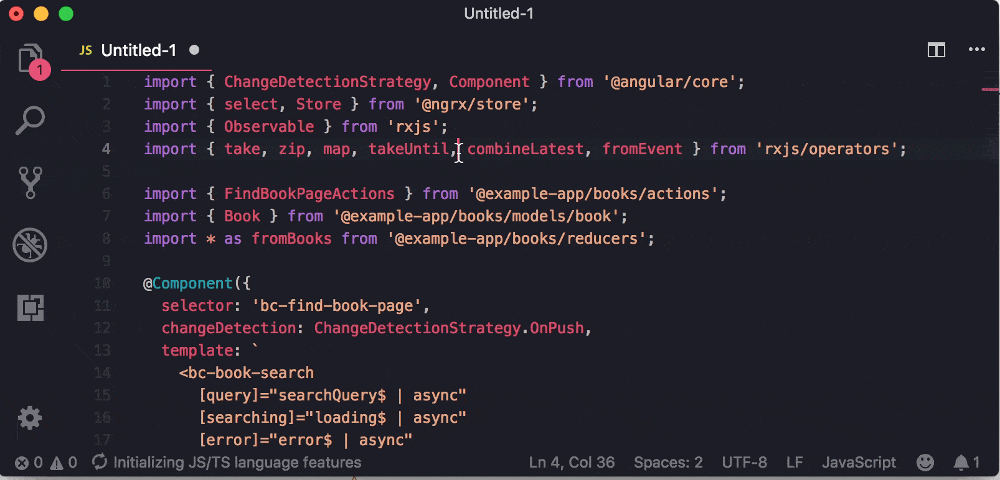
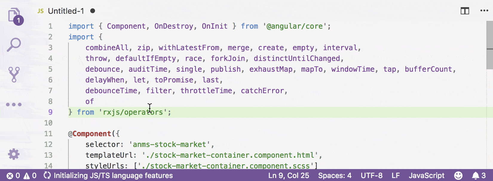

# impsorter

You might think the structure of your imports are important (*no pun intended*). This is an extension to help you sort your import statement in an easy convenient way.

## Features

### How to use
`vs-impsorter-extension` supports a number of commands for sorting import statements; these are acessible via the command menu `(Ctrl+Shift+P)` and may be bound to keyboard shortcuts in the normal way.

### Sort imports on one line selection

### Sort imports on regard of maximum line width

## Extension Settings

Extension Settings to be included later.

## Known Issues

This extension is still in development, initial release does not include a lot of functionality.

## Release Notes

* Please see CHANGELOG for latest release information.
